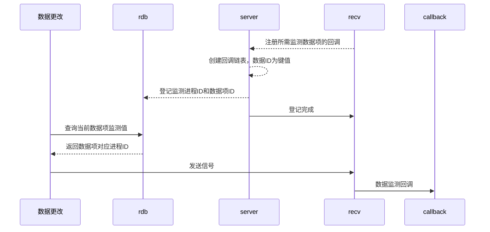

# 数据通知管理

进程注册及回调

```mermaid
sequenceDiagram
participant 数据更改
participant rdb
participant server
participant recv
participant callback
recv-->>server : 注册所需监测数据项的回调
server-->>server:创建回调链表，数据ID为键值
server-->>rdb : 登记监测进程ID和数据项ID
server->>recv : 登记完成
数据更改->>rdb : 查询当前数据项监测值
rdb-->>数据更改 : 返回数据项对应进程ID
数据更改->>recv : 发送信号
recv->>callback : 数据监测回调
```

信号只能传递一个整形参数，只传递32位的ID号，分为两个域。用来标识数据表还是数据项。最高位为1时，指的是数据表。最高位为0时，指的是数据项。数据项又可分为两个部分，组编号和信息编号。组编号占7位，最大127组，信息编号占24位。

